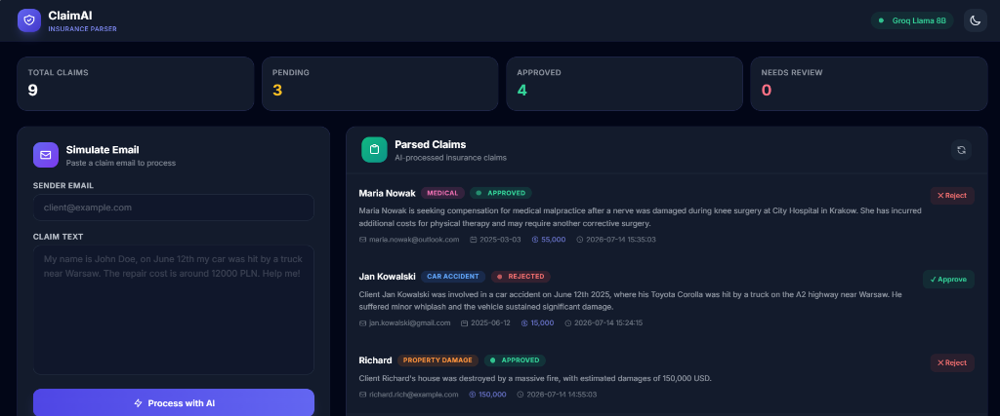
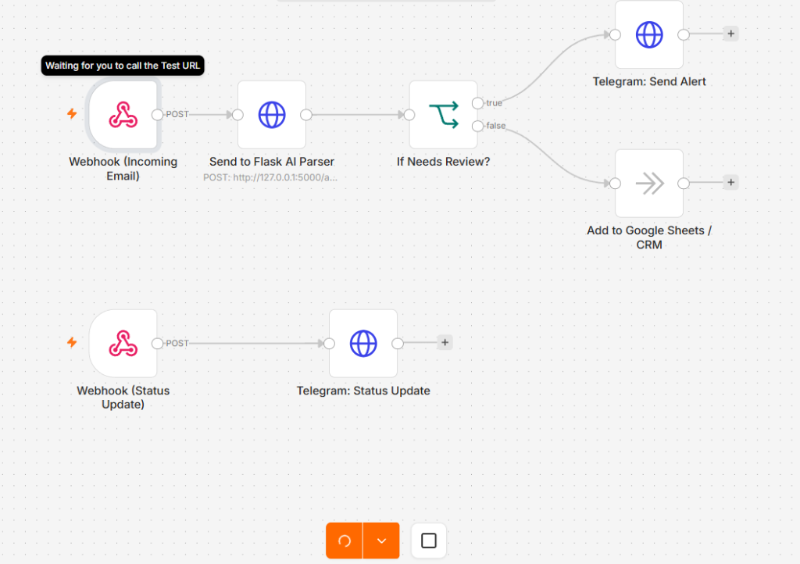
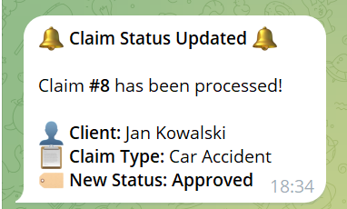

# 🛡️ AI Insurance Claim Parser & Lead Automation Dashboard

An AI-powered microservice designed to simulate how modern insurance and compensation companies automate the processing of incoming legal claims from emails. 

Using **Groq (Llama 3.1 8B)** as the primary engine and **Google Gemini** as a secondary fallback, this service automatically extracts structured data from messy, unstructured emails, categorizes them, estimates damages, and displays them on a sleek, responsive human-in-the-loop dashboard.

---

## 📸 Previews

### 💻 Lead Automation Dashboard (Dark Theme)


### 🔗 n8n Automated Workflow


### 🔔 Live Telegram Alerts


---

## 🚀 Features

*   **🧠 AI-Powered Parsing**: Uses structured output formats to extract names, incident dates, claim types, damage values, and generate brief summaries.
*   **⚖️ Smart Status Assignment**: Automatically suggests statuses (`Pending`, `Approved`, or `Requires Human Review`) based on claim value and completeness.
*   **🔄 Multi-Provider Fallback**: Cascades from Groq (Llama) to multiple Gemini models, and drops back to an offline Regex Mock parser if no API keys are configured.
*   **🎨 Premium Glassmorphism Dashboard**: Fully responsive dark/light UI built with Tailwind CSS, supporting toast notifications, dynamic table appends, and real-time updates.
*   **⚡ Automated 1-Click Operations**: Scripts for instant environment setup and concurrent backend/automation server launching.
*   **🔗 Out-of-the-Box n8n Integration**: Built-in triggers to feed parsed claims directly to Telegram channels/bots.

---

## 🛠️ Tech Stack

| Layer | Technology | Description |
| :--- | :--- | :--- |
| **Backend** | Python 3.12 / Flask | API routing, SQLite ORM, and environment handling |
| **Database** | SQLite (WAL mode) | Relational local storage with high concurrency |
| **AI Integration** | Groq SDK & Google GenAI SDK | Llama 3.1 8B (primary) and Gemini (fallback) |
| **Validation** | Pydantic v2 | Strict parsing schemas for structured JSON outputs |
| **Frontend** | Tailwind CSS v3 & Vanilla JS | Clean SPA-like dashboard with responsive views |

---

## 🏁 Quick Start

### 1️⃣ Clone and Setup
For Windows users, we have automated the environment setup:
1. Double-click [setup.bat](file:///c:/Users/maclaun/Desktop/auton8n/ai-claim-parser/setup.bat). This will create a Python virtual environment, install all dependencies, and copy `.env.example` to `.env`.

*For macOS/Linux users, run manually in terminal:*
```bash
cd ai-claim-parser
python -m venv venv
source venv/bin/activate
pip install -r requirements.txt
cp .env.example .env
```

### 2️⃣ Configure Credentials
1. Open `.env` and paste your `GROQ_API_KEY`.
2. Open [start-n8n.bat](file:///c:/Users/maclaun/Desktop/auton8n/ai-claim-parser/start-n8n.bat) and paste your Telegram bot credentials (token and chat ID).

> [!TIP]
> If you don't have any API keys, the app will run in **Mock Mode** using local regex parsing, allowing you to test the dashboard immediately.

### 3️⃣ Run Everything in One Click
For Windows users, run both the Flask server and n8n server concurrently:
1. Double-click [start-all.bat](file:///c:/Users/maclaun/Desktop/auton8n/ai-claim-parser/start-all.bat).

*For macOS/Linux, run manually:*
```bash
python app.py
```
The Flask web application will open automatically at **http://127.0.0.1:5000**.

---

## 🔗 n8n & Telegram Integration (Optional)

This project contains a pre-configured n8n workflow file: [n8n-workflow.json](file:///c:/Users/maclaun/Desktop/auton8n/ai-claim-parser/n8n-workflow.json). 

The workflow listens for new claims, parses them with Flask AI, and notifies a human reviewer in Telegram if the claim requires manual review. It also sends status updates to Telegram whenever you approve or reject a claim on the dashboard.

### 1. Setup Your Telegram Bot
1. Search for [@BotFather](https://t.me/BotFather) in Telegram.
2. Send `/newbot`, name your bot, and copy the **API Token** (looks like `123456789:ABCdefGhIJKlmNoPQRsTUVwxyZ`).
3. Search for [@userinfobot](https://t.me/userinfobot), click start, and copy your **Chat ID** (a number like `987654321`).
4. **IMPORTANT**: Open a chat with your newly created bot and click **Start** (otherwise the bot is blocked from messaging you).

### 2. Configure and Run n8n
1. **Configure Environment Variables**:
   - Open [start-n8n.bat](file:///c:/Users/maclaun/Desktop/auton8n/ai-claim-parser/start-n8n.bat) in a text editor.
   - Insert your Telegram credentials:
     ```bat
     set "TELEGRAM_BOT_TOKEN=YOUR_TELEGRAM_BOT_TOKEN"
     set "TELEGRAM_CHAT_ID=YOUR_TELEGRAM_CHAT_ID"
     ```
2. **Start the n8n server**: 
   - Double-click [start-n8n.bat](file:///c:/Users/maclaun/Desktop/auton8n/ai-claim-parser/start-n8n.bat).
3. **Access n8n dashboard**:
   - Open **http://127.0.0.1:5678** in your browser and complete the initial login.
4. **Import the workflow**:
   - Click **Build workflow** -> click the menu (three dots in top-right) -> select **Import from File**.
   - Choose `n8n-workflow.json` from the root of this project.
5. **No Credentials Needed**:
   - The workflow uses the environment variables defined in `start-n8n.bat`. The Telegram HTTP nodes automatically read them via `{{ $env.TELEGRAM_BOT_TOKEN }}` and `{{ $env.TELEGRAM_CHAT_ID }}`.

### 3. Connect Flask Webhook Notifications
If you want the dashboard simulation form and status buttons to trigger Telegram alerts:
1. In n8n, double-click the **Webhook (Status Update)** node and copy the **Test URL**.
2. Paste it in `.env` as `N8N_STATUS_WEBHOOK_URL=http://127.0.0.1:5678/webhook-test/status-update-trigger`.
3. Double-click the **Webhook (New Claim from Flask)** node, copy the **Test URL**, and paste it in `.env` as `N8N_NEW_CLAIM_WEBHOOK_URL=http://127.0.0.1:5678/webhook-test/new-claim-trigger`.
4. **Restart the server**: Restart your Flask server (`run.bat` or `start-all.bat`) so it loads the updated `.env` configuration.

---

## 🔌 API Endpoints

| Method | Endpoint | Description |
| :--- | :--- | :--- |
| `GET` | `/` | Serves the HTML dashboard page |
| `GET` | `/api/claims` | Returns all parsed claims in database |
| `POST` | `/api/incoming-claim` | Processes raw claim text using AI and stores it |
| `POST` | `/api/claim/<id>/status` | Updates the status of a specific claim |

### Submit a Claim via API (cURL)
```bash
curl -X POST http://127.0.0.1:5000/api/incoming-claim \
  -H "Content-Type: application/json" \
  -d '{
    "sender_email": "client@example.com",
    "raw_text": "My name is John Doe, on June 12th my car was hit by a truck near Warsaw. The repair cost is around 12000 PLN."
  }'
```

---

## 📂 Project Structure

```
ai-claim-parser/
├── app.py              # Flask server and API routes
├── ai_parser.py        # AI parser module (Groq Llama 3.1 8B / Gemini / Mock fallback)
├── database.py         # SQLite schema and CRUD database operations
├── models.py           # Pydantic schemas for structured output validation
├── n8n-workflow.json   # Exported n8n workflow for Telegram automation
├── requirements.txt    # Python dependencies
├── setup.bat           # Automated environment setup script
├── run.bat             # Startup script for Flask server
├── start-n8n.bat       # Startup script for n8n server with env variables
├── start-all.bat       # Concurrently launches Flask and n8n servers
├── .env.example        # Environment variables template
├── .gitignore          # Git ignore rules
└── templates/
    └── index.html      # Responsive dashboard frontend (Tailwind CSS)
```

---

## 📄 License

This project is licensed under the MIT License.
